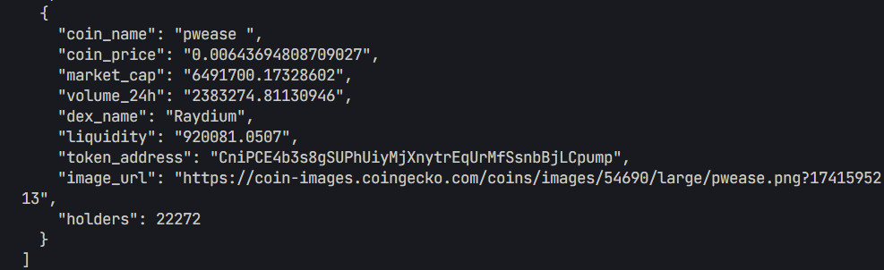

# Trending Tokens

A TypeScript-based tool to fetch and monitor trending token pools on Solana blockchain using the GeckoTerminal API.

## Features

- Fetches trending token pools from Solana network
- Filters pools by minimum liquidity ($1000)
- Provides detailed information for each pool:
  - Coin name
  - Current price
  - Market cap
  - 24h trading volume
  - DEX name (supports multiple Solana DEXes)
  - Liquidity
  - Token address

## Example

Example output:


You can also see a sample JSON response:
```json
{
    "coin_name": "pwease ",
    "coin_price": "0.00643694808709027",
    "market_cap": "6491700.17328602",
    "volume_24h": "2383274.81130946",
    "dex_name": "Raydium",
    "liquidity": "920081.0507",
    "token_address": "CniPCE4b3s8gSUPhUiyMjXnytrEqUrMfSsnbBjLCpump",
    "image_url": "https://coin-images.coingecko.com/coins/images/54690/large/pwease.png?1741595213",
    "holders": 22272
  }
```

## Installation

1. Clone the repository:
```bash
git clone https://github.com/Invictusdhahri/trending-tokens.git